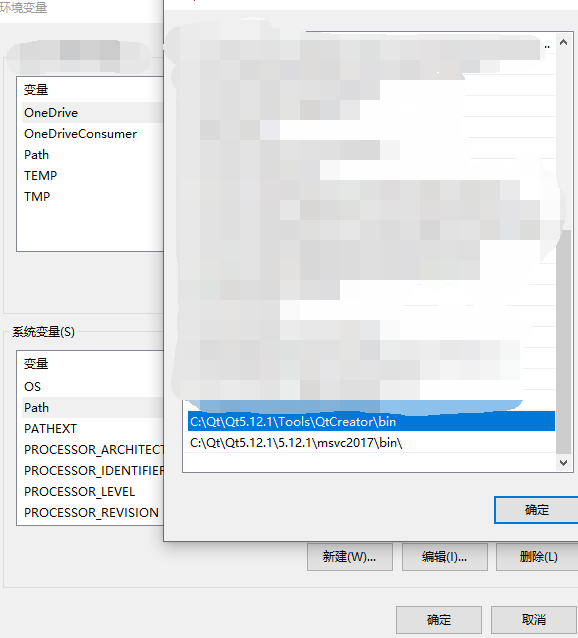

# CGAssistant

[中文README](READMECN.md)

CGAssistant is a helper for you to play CrossGate with highly automated game experience.

QQ Group: 300303705

## Warning

This project is only for academic purposes, commercial use is prohibited.

You are prohibited to publish this project elsewhere than GitHub.

All binaries included in the [Release Package](https://github.com/hzqst/CGAssistantJS) are compiled and built by [GitHub Actions](https://docs.github.com/en/actions/learn-github-actions) from [Source Code](https://github.com/hzqst/CGAssistant), which could be reviewed and supervised by everyone. There is no chance of having malware or virus in this project.

However we make no promises to your game accounts and so you have to use this project at your own risk, including taking any damage to your accounts from scripts and binaries.

This project is licensed under MIT License, however if it is otherwise stated before, the latter shall prevail.

## Links

[Source Code](https://github.com/hzqst/CGAssistant)

[Release](https://github.com/hzqst/CGAssistant/releases)

[Wiki](https://github.com/hzqst/CGAssistantJS/wiki)

## Build Requirement

1. [Visual Studio 2017 / 2019 / 2022, with vc141 / vc142 / vc143 toolset](https://visualstudio.microsoft.com/)

2. Windows SDK 10 (the msvc projects uses Windows SDK version 10.0.17763.0, please redirect to your local version if you have installed a different version of Windows SDK)

3. [QT 5.12+ for msvc2017, win32 (x86), with QtCreator](https://www.qt.io/download)

4. [NodeJS v14.16 (32-bit)](https://nodejs.org/download/release/v14.16.0/)

5. [node-gyp] (https://www.npmjs.com/package/node-gyp)

## Build Instruction

Let's assume that you have all requirements installed correctly.

1. Add "Qt5.xxx\Tools\QtCreator\bin\" and "Qt5.xxx\5.xxx\msvc2017\bin\" to your system environment variable "PATH" just like what is mentioned in the snapshot below.

2. Run "init-dep.bat", wait until all required submodules / dependencies are pulled. (this may takes couple of minutes, depending on your network connection and download speed)

3. Run "build-boost.bat", wait until all boost static libs are generated. (this may takes couple of minutes, depending on your CPU performance)

4. Run "build-CGAHook.bat", wait until "CGAHook.dll" is generated under "build" directory. Remember to redirect the Windows SDK version for msvc project if you have installed a different version of Windows SDK other than "10.0.17763.0".

5. Run "build-qhttp.bat", wait until "qhttp.dll" generated under "build" directory.

6. Run "build-CGAssiatant.bat", wait until "CGAssistant.exe" generated under "build" directory.

7. Run "build-nodegyp.bat", wait until "node_cga.node" generated under "build/Release" directory.

8. Run "windeploy.bat"

Now you have all compiled binaries copied into "build" directory if no error occured.
